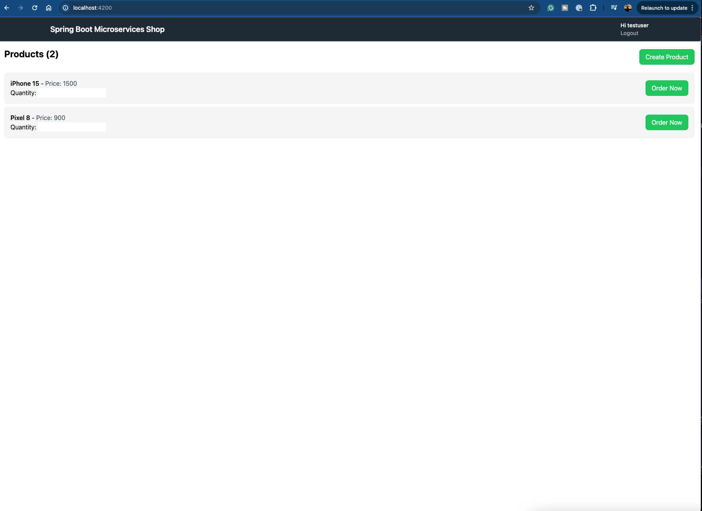

### README: MicroservicesShopFrontend (Español)

Este proyecto fue generado con [Angular CLI](https://github.com/angular/angular-cli) versión 18.0.2.

---

## 🚀 **Servidor de Desarrollo**

Ejecuta el siguiente comando para iniciar el servidor de desarrollo:

```shell
ng serve
```

Luego, accede a la aplicación en:  
🔗 `http://localhost:4200/`

La aplicación se recargará automáticamente al realizar cambios en los archivos fuente.

---

## 🖼️ **Capturas de Pantalla**

### 🏠 **Página de Inicio**  


### 🛒 **Página para Agregar Productos**  


---
✅ ¡Todo listo! Ahora puedes comenzar a explorar y modificar la aplicación. 🚀✨
